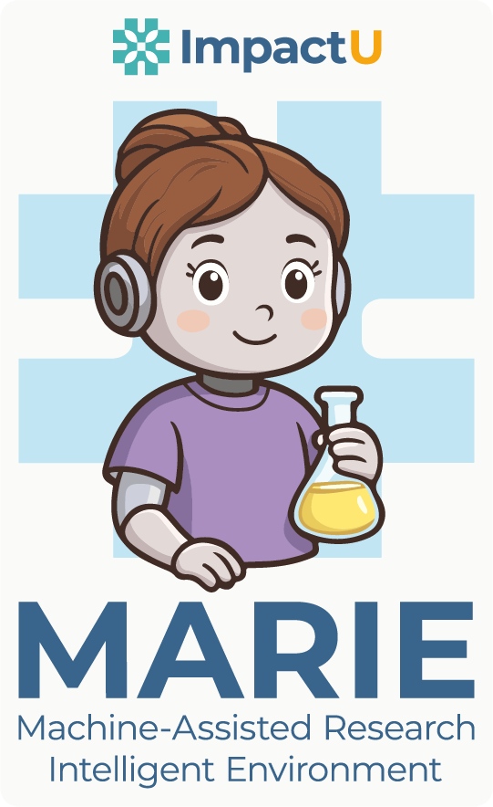
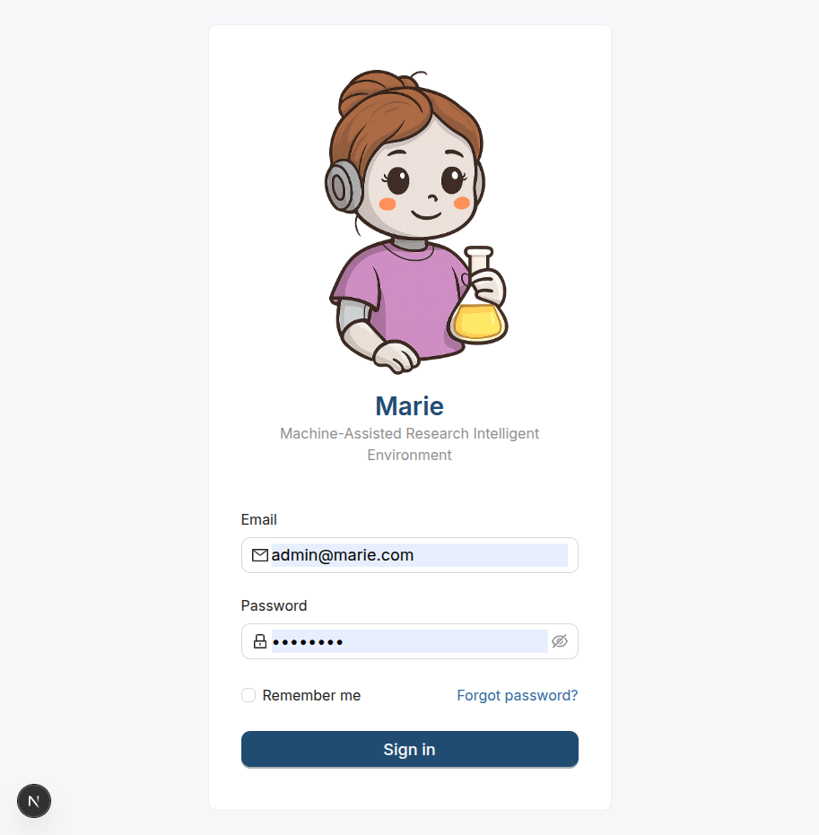
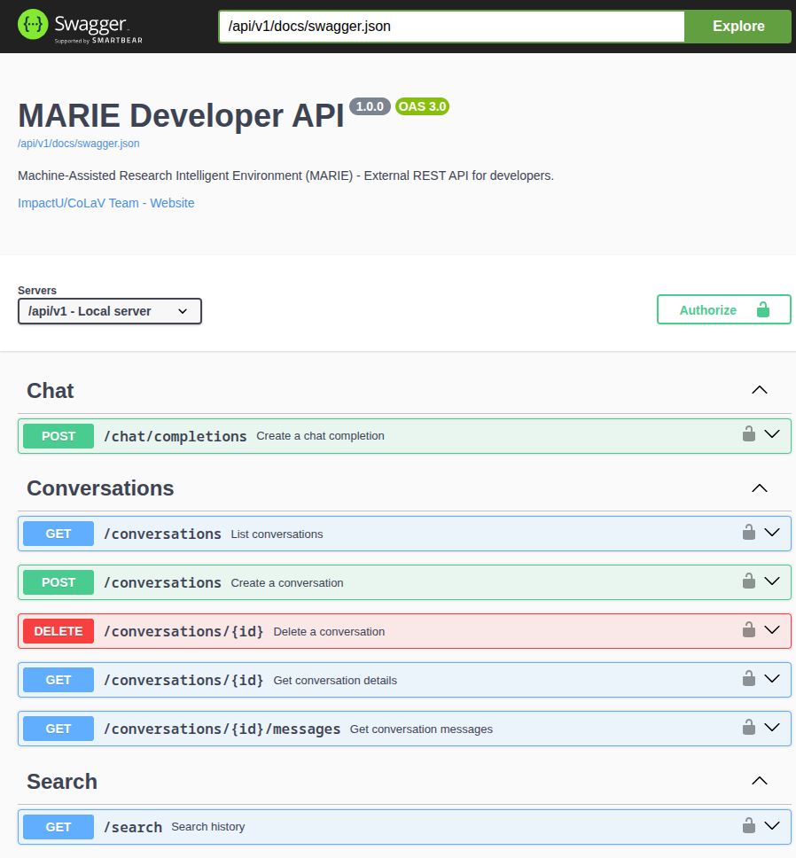

  

# MARIE: Machine-Assisted Research Intelligent Environment

MARIE is a state-of-the-art research assistant platform designed to provide an intelligent, extensible, and user-friendly environment for researchers and developers.

## 🚀 Main Features

### 1. Modern & Intelligent Chat Interface
A clean, responsive interface built with **Next.js 16** and **React 19**, featuring:
- **Automatic Titling**: Conversations are automatically named by the LLM based on the first interaction.
- **Rich Content Support**: Full support for Markdown, LaTeX equations, and syntax-highlighted code blocks.
- **Multimedia Integration**: Upload files, generate images, and use voice commands directly in the chat.

*Landing Page - Modern and clean design*

*Intelligent Chat Interface with auto-titling and rich content*

### 2. Developer API v1
A robust REST API that allows developers to integrate MARIE's intelligence into their own applications:
- **API Key Management**: Secure SHA-256 hashed keys for external access.
- **Swagger Documentation**: Interactive documentation available at \`/api/v1/docs\`.
- **Standard Endpoints**: Chat completions, conversation management, and search history.

*Interactive Swagger UI for the Developer API*

### 3. Advanced Admin Console
Centralized control panel for system administrators:
- **Dynamic Model Selection**: Real-time fetching of available models from Ollama and HuggingFace.
- **System Configuration**: Easy management of providers, default models, and system-wide settings.
- **User Management**: Control access and permissions for all users.

*Admin Console - Dynamic model and provider configuration*

### 4. Multi-Model & Multi-Modal Support
- **Ollama Integration**: Run powerful models locally for privacy and speed.
- **HuggingFace Integration**: Access thousands of cloud-hosted models.
- **Image Generation**: Create visual content using integrated AI models.
- **Voice Features**: Speech-to-Text (STT) and Text-to-Speech (TTS) capabilities.

## 🛠 Tech Stack

- **Frontend**: Next.js 16.1.1, React 19.2.3, Ant Design 6.x, Tailwind CSS.
- **Backend**: Flask 3.x, Python 3.12, Socket.io for real-time communication.
- **Database**: OpenSearch 2.11 for high-performance search and storage.
- **Infrastructure**: Docker & Docker Compose for easy deployment.

## 📦 Quick Start

1. **Clone the repository**:
   \`\`\`bash
   git clone https://github.com/omazapa/marie_chat.git
   cd marie_chat
   \`\`\`

2. **Start with Docker**:
   \`\`\`bash
   docker-compose up -d
   \`\`\`

3. **Access the services**:
   - **Frontend**: [http://localhost:3000](http://localhost:3000)
   - **API Docs**: [http://localhost:5000/api/v1/docs](http://localhost:5000/api/v1/docs)
   - **OpenSearch Dashboards**: [http://localhost:5601](http://localhost:5601)

---
Developed by **ImpactU / CoLaV Team**.
