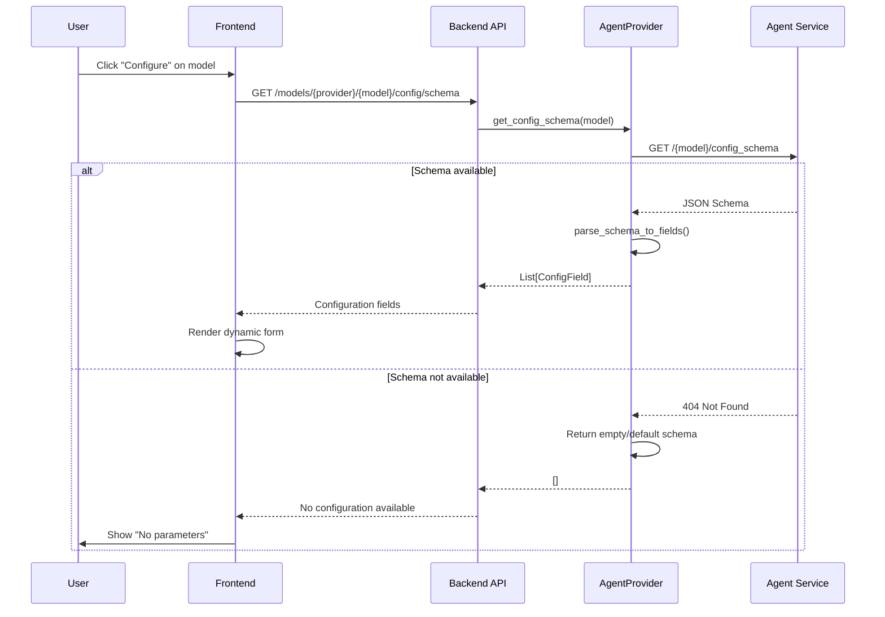
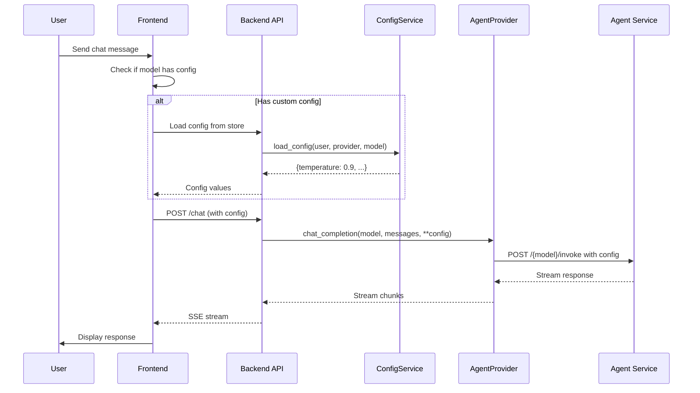

# Dynamic Agent Configuration - Technical Proposal

**Date:** January 4, 2026
**Author:** AI Assistant
**Status:** Draft for Review

---

## 1. Executive Summary

This document proposes a solution for **dynamically discovering and configuring runtime parameters** of LangChain/LangGraph agents exposed via OpenAI-compatible APIs. The proposal leverages existing standards (LangServe, OpenAI API) and extends the current MARIE architecture to support:

1. **Auto-discovery** of agent configuration schemas
2. **Dynamic UI generation** for parameter modification
3. **Real-time configuration** without code changes
4. **Provider-agnostic** design compatible with any OpenAI-compatible agent service

---

## 2. Problem Statement

### Current State
- MARIE connects to external agents via OpenAI-compatible API (e.g., `http://localhost:9099/`)
- Agents support configurable parameters (model selection, temperature, tools, etc.)
- **No mechanism** to discover or modify these parameters from the UI
- Configuration is static and hardcoded in backend

### Requirements
- **Discover** available parameters dynamically from agent service
- **Generate UI** controls automatically based on parameter schemas
- **Apply configuration** at runtime per conversation or globally
- **Maintain compatibility** with existing chat flow and providers

---

## 3. Technical Analysis

### 3.1 OpenAI-Compatible Pipeline Standards

Based on research and endpoint testing at `http://localhost:9099/`:

#### Available Endpoints
```bash
# Model/Pipeline Discovery
GET /v1/models
GET /pipelines

# Pipeline Configuration (if supported)
GET /pipelines/{pipeline_id}/valves  # Open WebUI specific
GET /{pipeline_id}/config_schema     # LangServe standard
GET /{pipeline_id}/input_schema      # LangServe standard (already used)
```

#### Current Implementation Status
```json
// Tested: http://localhost:9099/v1/models
{
  "data": [
    {
      "id": "marie_reasoning_agent",
      "name": "MARIE Reasoning Agent",
      "pipeline": {
        "type": "pipe",
        "valves": true  // ✅ Indicates configurable parameters
      }
    },
    {
      "id": "marie_rag_pipeline",
      "name": "MARIE ImpactU",
      "pipeline": {
        "type": "pipe",
        "valves": true
      }
    }
  ]
}
```

### 3.2 Parameter Discovery Strategies

#### Strategy A: LangServe Config Schema (Preferred)
LangServe exposes configuration via standard endpoints:

```python
# LangServe automatically generates:
GET /{agent}/config_schema  # JSON Schema for Runnable.configurable
```

**Example Schema:**
```json
{
  "type": "object",
  "properties": {
    "configurable": {
      "type": "object",
      "properties": {
        "model": {
          "type": "string",
          "enum": ["gpt-4", "gpt-3.5-turbo", "claude-3-opus"],
          "default": "gpt-4",
          "description": "LLM model to use"
        },
        "temperature": {
          "type": "number",
          "minimum": 0,
          "maximum": 2,
          "default": 0.7,
          "description": "Sampling temperature"
        },
        "max_iterations": {
          "type": "integer",
          "minimum": 1,
          "maximum": 10,
          "default": 5
        }
      }
    }
  }
}
```

#### Strategy B: Open WebUI Valves API
Open WebUI pipelines expose "valves" (configuration parameters):

```python
# Pipeline exposes valves metadata
GET /pipelines/{id}/valves
```

**Example Response:**
```json
{
  "OPENAI_API_KEY": {
    "type": "str",
    "default": "",
    "description": "OpenAI API key for the pipeline"
  },
  "model_name": {
    "type": "str",
    "default": "gpt-4",
    "enum": ["gpt-4", "gpt-3.5-turbo"]
  },
  "temperature": {
    "type": "float",
    "default": 0.7,
    "range": [0, 2]
  }
}
```

#### Strategy C: Runtime Config in Request
If schemas aren't available, pass configuration in request:

```json
POST /{agent}/invoke
{
  "input": {...},
  "config": {
    "configurable": {
      "model": "gpt-4",
      "temperature": 0.9
    }
  }
}
```

---

## 4. Proposed Architecture

### 4.1 Backend Components

#### 4.1.1 Enhanced Agent Provider
```python
# backend/app/services/agent_provider.py

class AgentProvider(LLMProvider):
    """Extended provider with dynamic configuration support"""

    async def get_config_schema(self, model: str) -> dict[str, Any] | None:
        """
        Fetch configuration schema from agent service.
        Tries multiple strategies in order:
        1. LangServe /config_schema
        2. Open WebUI /valves
        3. OpenAPI schema inspection
        """

    async def get_config_values(self, model: str) -> dict[str, Any]:
        """Get current configuration values for a model"""

    async def set_config_values(
        self,
        model: str,
        config: dict[str, Any]
    ) -> bool:
        """Update configuration for a model (if service supports it)"""

    def parse_schema_to_fields(
        self,
        schema: dict
    ) -> list[ConfigField]:
        """Convert JSON Schema to UI-friendly field definitions"""
```

#### 4.1.2 New Configuration Service
```python
# backend/app/services/agent_config_service.py

from pydantic import BaseModel, Field
from typing import Any, Literal

class ConfigField(BaseModel):
    """Represents a single configuration field"""
    key: str
    label: str
    type: Literal["string", "number", "integer", "boolean", "enum"]
    default: Any
    description: str | None = None
    min: float | None = None
    max: float | None = None
    enum_values: list[str] | None = None
    required: bool = False

class AgentConfigService:
    """Service for managing agent configurations"""

    async def discover_config(
        self,
        provider: str,
        model: str
    ) -> list[ConfigField]:
        """Discover available configuration fields"""

    async def save_config(
        self,
        user_id: str,
        provider: str,
        model: str,
        config: dict[str, Any],
        scope: Literal["global", "conversation"] = "global"
    ):
        """Save configuration (DB or in-memory)"""

    async def load_config(
        self,
        user_id: str,
        provider: str,
        model: str,
        conversation_id: str | None = None
    ) -> dict[str, Any]:
        """Load saved configuration"""
```

#### 4.1.3 New API Endpoints
```python
# backend/app/routes/agent_config.py

@router.get("/models/{provider}/{model}/config/schema")
async def get_agent_config_schema(
    provider: str,
    model: str,
    current_user: User = Depends(get_current_user)
) -> list[ConfigField]:
    """Get configuration schema for an agent"""

@router.get("/models/{provider}/{model}/config/values")
async def get_agent_config_values(
    provider: str,
    model: str,
    conversation_id: str | None = None,
    current_user: User = Depends(get_current_user)
) -> dict[str, Any]:
    """Get current config values (with defaults)"""

@router.post("/models/{provider}/{model}/config/values")
async def set_agent_config_values(
    provider: str,
    model: str,
    config: dict[str, Any],
    scope: Literal["global", "conversation"] = "global",
    conversation_id: str | None = None,
    current_user: User = Depends(get_current_user)
):
    """Update configuration values"""
```

### 4.2 Frontend Components

#### 4.2.1 Agent Configuration Modal
```typescript
// frontend/components/chat/AgentConfigModal.tsx

interface ConfigField {
  key: string;
  label: string;
  type: 'string' | 'number' | 'integer' | 'boolean' | 'enum';
  default: any;
  description?: string;
  min?: number;
  max?: number;
  enumValues?: string[];
  required: boolean;
}

interface AgentConfigModalProps {
  visible: boolean;
  onClose: () => void;
  provider: string;
  model: string;
  conversationId?: string;
  scope: 'global' | 'conversation';
}

export default function AgentConfigModal({...}: AgentConfigModalProps) {
  const [fields, setFields] = useState<ConfigField[]>([]);
  const [values, setValues] = useState<Record<string, any>>({});
  const [loading, setLoading] = useState(false);

  // Fetch schema and current values
  useEffect(() => {
    fetchConfigSchema();
    fetchConfigValues();
  }, [provider, model, conversationId]);

  // Render dynamic form based on field types
  const renderField = (field: ConfigField) => {
    switch (field.type) {
      case 'enum':
        return <Select options={field.enumValues} />;
      case 'number':
      case 'integer':
        return <InputNumber min={field.min} max={field.max} />;
      case 'boolean':
        return <Switch />;
      default:
        return <Input />;
    }
  };

  return (
    <Modal title="Configure Agent Parameters">
      <Form>
        {fields.map(field => (
          <Form.Item
            key={field.key}
            label={field.label}
            tooltip={field.description}
            required={field.required}
          >
            {renderField(field)}
          </Form.Item>
        ))}
      </Form>
    </Modal>
  );
}
```

#### 4.2.2 Enhanced Model Selector
```typescript
// frontend/components/chat/ModelSelector.tsx (enhanced)

export default function ModelSelector({...}) {
  // Add config indicator badge
  const hasCustomConfig = useCallback((provider: string, model: string) => {
    // Check if model has custom configuration
    return configStore.hasConfig(provider, model);
  }, []);

  return (
    <Select>
      {models.map(model => (
        <Option key={model.id} value={model.id}>
          <Space>
            {model.name}
            {hasCustomConfig(provider, model.id) && (
              <Badge status="processing" text="Configured" />
            )}
            {model.pipeline?.valves && (
              <Tooltip title="Configurable parameters available">
                <SettingOutlined
                  onClick={() => openConfigModal(provider, model.id)}
                />
              </Tooltip>
            )}
          </Space>
        </Option>
      ))}
    </Select>
  );
}
```

#### 4.2.3 Configuration Store
```typescript
// frontend/stores/agentConfigStore.ts

interface AgentConfig {
  provider: string;
  model: string;
  scope: 'global' | 'conversation';
  conversationId?: string;
  values: Record<string, any>;
  updatedAt: string;
}

interface AgentConfigStore {
  configs: AgentConfig[];

  loadConfig: (provider: string, model: string, conversationId?: string) => Promise<void>;
  saveConfig: (config: AgentConfig) => Promise<void>;
  resetConfig: (provider: string, model: string) => void;
  hasConfig: (provider: string, model: string) => boolean;
}

export const useAgentConfig = create<AgentConfigStore>((set, get) => ({
  configs: [],

  loadConfig: async (provider, model, conversationId) => {
    const response = await apiClient.get(
      `/models/${provider}/${model}/config/values`,
      { params: { conversation_id: conversationId } }
    );

    set(state => ({
      configs: [
        ...state.configs.filter(c =>
          c.provider !== provider || c.model !== model
        ),
        { provider, model, conversationId, values: response.data }
      ]
    }));
  },

  saveConfig: async (config) => {
    await apiClient.post(
      `/models/${config.provider}/${config.model}/config/values`,
      config.values,
      { params: { scope: config.scope, conversation_id: config.conversationId } }
    );

    set(state => ({
      configs: [
        ...state.configs.filter(c =>
          c.provider !== config.provider ||
          c.model !== config.model ||
          c.conversationId !== config.conversationId
        ),
        { ...config, updatedAt: new Date().toISOString() }
      ]
    }));
  },

  // ... other methods
}));
```

---

## 5. Implementation Plan

### Phase 1: Backend Foundation (Week 1)
- [ ] Implement `get_config_schema()` in `AgentProvider`
- [ ] Add fallback strategies (LangServe → Valves → Manual)
- [ ] Create `AgentConfigService` with in-memory storage
- [ ] Add configuration endpoints to API

### Phase 2: Frontend UI (Week 1-2)
- [ ] Create `AgentConfigModal` component
- [ ] Implement dynamic form generation from schema
- [ ] Add configuration store (Zustand)
- [ ] Integrate with `ModelSelector`

### Phase 3: Persistence (Week 2)
- [ ] Add database model for agent configurations
- [ ] Implement per-user and per-conversation scopes
- [ ] Add migration scripts

### Phase 4: Integration & Testing (Week 3)
- [x] Load configuration before chat requests
- [x] Apply configuration in LLMService
- [x] Pass config to AgentProvider
- [x] Merge config with request parameters
- [x] Test with `marie_reasoning_agent` and `marie_rag_pipeline`

### Phase 4: Testing & Documentation (Week 3)
- [ ] Update user documentation
- [ ] Add tooltips and help text
- [ ] Create demo video
- [ ] Code review and refactoring

---

## 6. Configuration Flow

### 6.1 Discovery Flow


### 6.2 Application Flow


---

## 7. OpenSearch Schema (Persistence)

MARIE uses OpenSearch for all data persistence. Agent configurations will follow the same pattern.

### 7.1 Index Mapping
```json
// Index: marie_agent_configs
{
  "mappings": {
    "properties": {
      "id": { "type": "keyword" },
      "user_id": { "type": "keyword" },
      "provider": { "type": "keyword" },
      "model_id": { "type": "keyword" },
      "scope": { "type": "keyword" },
      "conversation_id": { "type": "keyword" },
      "config_values": { "type": "object", "enabled": true },
      "created_at": { "type": "date" },
      "updated_at": { "type": "date" }
    }
  }
}
```

### 7.2 Document Structure
```json
{
  "id": "uuid-v4",
  "user_id": "user-uuid",
  "provider": "agent",
  "model_id": "marie_reasoning_agent",
  "scope": "conversation",
  "conversation_id": "conv-uuid",
  "config_values": {
    "model": "gpt-4",
    "temperature": 0.9,
    "max_iterations": 5,
    "tools": ["search", "calculator"]
  },
  "created_at": "2026-01-04T10:30:00Z",
  "updated_at": "2026-01-04T10:30:00Z"
}
```

### 7.3 Query Patterns
```python
# Get user's global config for a model
query = {
    "query": {
        "bool": {
            "must": [
                {"term": {"user_id": user_id}},
                {"term": {"provider": provider}},
                {"term": {"model_id": model_id}},
                {"term": {"scope": "global"}}
            ]
        }
    }
}

# Get conversation-specific config
query = {
    "query": {
        "bool": {
            "must": [
                {"term": {"user_id": user_id}},
                {"term": {"conversation_id": conversation_id}},
                {"term": {"provider": provider}},
                {"term": {"model_id": model_id}},
                {"term": {"scope": "conversation"}}
            ]
        }
    }
}
```

---

## 8. Example Usage

### 8.1 User Workflow
1. User opens chat interface
2. Selects "MARIE Reasoning Agent" from model dropdown
3. Sees ⚙️ icon next to model name (indicates configurable)
4. Clicks configuration icon
5. Modal opens showing:
   - **Model**: Dropdown (gpt-4, claude-3-opus, llama-3.1-70b)
   - **Temperature**: Slider (0.0 - 2.0)
   - **Max Iterations**: Number input (1-10)
   - **Tools**: Multi-select checkboxes
   - **Scope**: Radio buttons (This conversation / All conversations)
6. Adjusts temperature to 0.9 and selects GPT-4
7. Saves configuration
8. Continues chatting with custom parameters applied

### 8.2 Code Example

#### Backend: Applying Configuration
```python
# backend/app/services/agent_provider.py

async def chat_completion(
    self,
    model: str,
    messages: list[ChatMessage],
    user_id: str,
    conversation_id: str | None = None,
    temperature: float = 0.7,
    **kwargs
) -> AsyncGenerator[ChatCompletionChunk, None]:
    # Load user's custom configuration
    config_service = AgentConfigService()
    custom_config = await config_service.load_config(
        user_id=user_id,
        provider="agent",
        model=model,
        conversation_id=conversation_id
    )

    # Merge with request parameters (request takes precedence)
    final_config = {**custom_config, **kwargs, "temperature": temperature}

    # Prepare payload with configuration
    payload = await self._prepare_payload(model, messages, **final_config)

    # Make request
    async for chunk in self._stream_remote(model, payload, headers):
        yield chunk
```

#### Frontend: Configuration Dialog
```typescript
// User clicks configure button
const handleConfigure = async () => {
  setConfigModalVisible(true);

  // Fetch schema
  const schema = await apiClient.get(
    `/models/${provider}/${modelId}/config/schema`
  );
  setConfigFields(schema.data);

  // Fetch current values
  const values = await apiClient.get(
    `/models/${provider}/${modelId}/config/values`,
    { params: { conversation_id: conversationId } }
  );
  setConfigValues(values.data);
};

// User saves configuration
const handleSave = async (values: Record<string, any>) => {
  await apiClient.post(
    `/models/${provider}/${modelId}/config/values`,
    values,
    { params: { scope, conversation_id: conversationId } }
  );

  message.success('Configuration saved successfully');
  setConfigModalVisible(false);
};
```

---

## 9. Advantages of This Approach

### 9.1 Dynamic Discovery
- ✅ **No hardcoding**: Parameters are discovered from service
- ✅ **Automatic updates**: New parameters appear automatically
- ✅ **Provider agnostic**: Works with any compliant service

### 9.2 User Experience
- ✅ **Visual configuration**: No need to edit config files
- ✅ **Per-conversation settings**: Different configs for different chats
- ✅ **Immediate feedback**: See parameter descriptions and constraints
- ✅ **Validation**: Type checking and range validation built-in

### 9.3 Developer Experience
- ✅ **Standardized**: Uses LangServe and OpenAI API standards
- ✅ **Extensible**: Easy to add new field types
- ✅ **Type-safe**: Full TypeScript support
- ✅ **Testable**: Clear separation of concerns

---

## 10. Limitations & Considerations

### 10.1 Service Compatibility
- **Not all services expose schemas**: Fallback to manual configuration
- **Schema inconsistencies**: Different formats across providers
- **Dynamic validation**: Client-side validation may differ from server

### 10.2 Configuration Scope
- **Global vs conversation**: Need clear UX to distinguish
- **Inheritance**: Conversation config overrides global config
- **Defaults**: Service defaults vs user defaults

### 10.3 Security
- **Sensitive parameters**: API keys should not be user-configurable
- **Parameter injection**: Validate and sanitize all inputs
- **Rate limiting**: Prevent abuse of configuration endpoints

---

## 11. Alternative Approaches Considered

### Approach 1: Static Configuration Files
**Rejected**: Not flexible, requires deployment for changes

### Approach 2: Admin-only Configuration
**Rejected**: Limits user personalization

### Approach 3: Natural Language Configuration
**Considered for future**: "Use GPT-4 with higher creativity" → AI maps to config
**Status**: Phase 2 feature

---

## 12. Testing Strategy

### 12.1 Unit Tests
- Schema parsing from various formats
- Field type conversion
- Configuration merging logic

### 12.2 Integration Tests
- End-to-end configuration flow
- Multiple agent types
- Configuration persistence

### 12.3 UI Tests
- Dynamic form generation
- Field validation
- Save/load operations

---

## 13. Success Metrics

- **Configuration discovery**: 100% of agents with valves/config_schema detected
- **UI responsiveness**: Form generation < 500ms
- **Configuration persistence**: 99.9% reliability
- **User adoption**: 60%+ of users configure at least one parameter
- **Error rate**: < 1% configuration-related errors

---

## 14. Future Enhancements

### Phase 2 (Q2 2026)
- **Configuration templates**: Predefined "Creative", "Precise", "Balanced"
- **A/B testing**: Compare different configurations
- **Configuration sharing**: Share configs between users
- **Natural language**: "Make it more creative" → temperature++

### Phase 3 (Q3 2026)
- **Configuration recommendations**: ML-based suggestions
- **Cost estimation**: Show estimated cost per configuration
- **Performance metrics**: Track response quality by config

---

## 15. Conclusion

This proposal provides a comprehensive solution for dynamic agent configuration in MARIE, leveraging industry standards while maintaining flexibility and user experience. The phased implementation allows for iterative development and validation.

**Recommended Next Steps:**
1. Review and approve architecture
2. Test schema discovery with `marie_reasoning_agent`
3. Prototype `AgentConfigModal` component
4. Implement Phase 1 backend foundation

---

## Appendices

### A. JSON Schema Example (Full)
```json
{
  "$schema": "http://json-schema.org/draft-07/schema#",
  "type": "object",
  "title": "MARIE Reasoning Agent Configuration",
  "properties": {
    "configurable": {
      "type": "object",
      "properties": {
        "model": {
          "type": "string",
          "title": "Language Model",
          "description": "The LLM to use for reasoning",
          "enum": ["gpt-4", "gpt-4-turbo", "claude-3-opus", "llama-3.1-70b"],
          "default": "gpt-4"
        },
        "temperature": {
          "type": "number",
          "title": "Temperature",
          "description": "Controls randomness (0=deterministic, 2=creative)",
          "minimum": 0.0,
          "maximum": 2.0,
          "default": 0.7
        },
        "max_iterations": {
          "type": "integer",
          "title": "Max Reasoning Steps",
          "description": "Maximum number of reasoning iterations",
          "minimum": 1,
          "maximum": 10,
          "default": 5
        },
        "enable_tools": {
          "type": "boolean",
          "title": "Enable Tools",
          "description": "Allow agent to use external tools",
          "default": true
        },
        "tools": {
          "type": "array",
          "title": "Available Tools",
          "description": "Select which tools the agent can use",
          "items": {
            "type": "string",
            "enum": ["search", "calculator", "database", "code_execution"]
          },
          "default": ["search", "calculator"]
        }
      }
    }
  }
}
```

### B. API Client Examples
```typescript
// Fetch configuration schema
const schema = await apiClient.get<ConfigField[]>(
  `/models/agent/marie_reasoning_agent/config/schema`
);

// Get current configuration
const config = await apiClient.get<Record<string, any>>(
  `/models/agent/marie_reasoning_agent/config/values`,
  { params: { conversation_id: 'abc-123' } }
);

// Save configuration
await apiClient.post(
  `/models/agent/marie_reasoning_agent/config/values`,
  { temperature: 0.9, model: 'gpt-4' },
  { params: { scope: 'conversation', conversation_id: 'abc-123' } }
);
```

---

**Document Version:** 1.0
**Last Updated:** January 4, 2026
